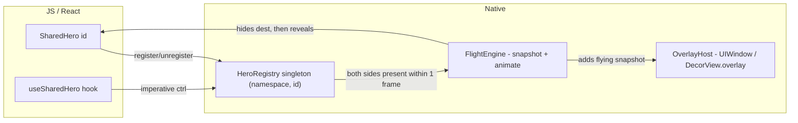

# react-native-shared-hero — implementation plan

## North-star design

- **Public API (wrapper-style)** — `<SharedHero id="cover-42" mode="morph">{children}</SharedHero>`. Children become the visible element; the wrapper is a Fabric host view that registers itself with the native registry on mount/unmount.
- **No JS Provider required.** The native overlay window (iOS) / decor overlay (Android) is created lazily on first use. An optional `<SharedHeroNamespace name="...">` is exposed for advanced cases.
- **Match by id, debounced by one frame.** When a `SharedHero` unmounts and another mounts with the same `(namespace, id)` within ~1 native frame, we trigger a flight. This makes it work for native-stack push/pop, tab switches, modals, AND in-place state toggles — without ever looking at React Navigation events.
- **Window-level overlay** so flights render above native modals / sheets / transparentModal. This is exactly the limitation Reanimated SET is still struggling with.
- **Three v1 modes**: `snapshot` (cheap clone, translate+scale+crossfade), `morph` (Material container transform — corner radius / bg / size interpolation), `shuttle` (render a custom React subtree mid-flight, like Flutter's `flightShuttleBuilder`).
- **Native drivers**: `CADisplayLink` on iOS, `Choreographer.postFrameCallback` on Android. Zero JS per frame.

## Architecture sketch



## Phases & file map

### Phase 0 — plumbing & Swift migration
Clean the `create-react-native-library` scaffold leftovers (the `color` prop) and migrate iOS from Obj-C to Swift while keeping the Fabric Obj-C++ shim minimal.

- Replace stub in [src/SharedHeroView.tsx](src/SharedHeroView.tsx) and [src/SharedHeroViewNativeComponent.ts](src/SharedHeroViewNativeComponent.ts) — drop `color`, add the real props (see Phase 1).
- Update [src/index.tsx](src/index.tsx) to export the new public API.
- Replace [ios/SharedHeroView.h](ios/SharedHeroView.h) + [ios/SharedHeroView.mm](ios/SharedHeroView.mm) with a thin Obj-C++ subclass of `RCTViewComponentView` that forwards `updateProps` and lifecycle to a Swift class (`SharedHeroViewImpl.swift`). Pattern: the `.mm` only implements `+componentDescriptorProvider`, `-init`, `-updateProps:oldProps:`, `-prepareForRecycle`, `-mountChildComponentView:index:`, `-unmountChildComponentView:index:`. Everything else lives in Swift.
- Add Swift bridging header `ios/SharedHero-Bridging-Header.h`; update [SharedHero.podspec](SharedHero.podspec) — `s.source_files` already includes `.swift`, so it should pick them up; add `s.swift_versions` and `s.pod_target_xcconfig` for `SWIFT_OBJC_BRIDGING_HEADER`.
- Rewrite [android/src/main/java/com/sharedhero/SharedHeroView.kt](android/src/main/java/com/sharedhero/SharedHeroView.kt) to extend `ViewGroup` (so children can be hosted) and [SharedHeroViewManager.kt](android/src/main/java/com/sharedhero/SharedHeroViewManager.kt) to drop `color` and add real props.
- Update `codegenConfig` in [package.json](package.json) — keep `SharedHeroViewSpec` name, add a TurboModule spec entry once we add the imperative API in Phase 4.

### Phase 1 — registry + minimal `snapshot` flight (end-to-end MVP)
First runnable feature: list → detail image hero works on both platforms with a simple translate+scale flight.

JS additions:
- New [src/types.ts](src/types.ts) — `SharedHeroMode`, `SharedHeroProps`, `FadeMode`, `SpringConfig`.
- Rewrite [src/SharedHeroView.tsx](src/SharedHeroView.tsx) — thin React wrapper around the native component, default `mode="snapshot"`, defaults `namespace="default"`.
- Update [src/SharedHeroViewNativeComponent.ts](src/SharedHeroViewNativeComponent.ts) — codegen props: `id: string`, `nativeNamespace: string`, `mode: string`, `duration?: Int32`, `springDamping?: Float`, `springStiffness?: Float`, `springMass?: Float`, `fadeMode?: string`, `enabled?: boolean`, plus `onTransitionStart`/`onTransitionEnd` direct event bubbling.

iOS additions (Swift, all in `ios/`):
- `ios/HeroRegistry.swift` — singleton, dictionary `[NamespacedId: WeakBox<SharedHeroViewImpl>]`. `register(view)`, `unregister(view)`. On unregister, schedule `CATransaction.begin/commit` after-callback (or 1-runloop dispatch) to check if a replacement appeared.
- `ios/OverlayHost.swift` — owns a `UIWindow` at `windowLevel = .alert + 1`, lazily created, transparent, `isHidden = false` only while a flight is active. Handles rotation via `UIWindowScene`.
- `ios/FlightEngine.swift` — given source + destination `SharedHeroViewImpl`s and config, snapshots both (`snapshotView(afterScreenUpdates: false)` for source, `true` for dest, fallback to `drawHierarchy(in:afterScreenUpdates:)` if needed), adds to `OverlayHost`, animates via `CADisplayLink` from source frame/transform to dest frame/transform, hides dest's content view until completion, then removes the snapshot and reveals dest.
- `ios/SharedHeroViewImpl.swift` — the Swift companion to the Obj-C++ shim. Holds the `id`/`namespace`/config, manages the content container, calls `HeroRegistry.register/unregister`.

Android additions (Kotlin, all in `android/src/main/java/com/sharedhero/`):
- `HeroRegistry.kt` — same idea as iOS, plus `Choreographer.postFrameCallback` for the 1-frame debounce check.
- `OverlayHost.kt` — uses `activity.window.decorView.overlay.add(view)` (the `ViewOverlay` API), which renders above bottom sheets, dialogs, sheet fragments.
- `FlightEngine.kt` — snapshot via `View.draw(Canvas)` into a `Bitmap` (or `RenderNode.beginRecording` on API 29+), wrap in an `ImageView`, animate via `Choreographer.postFrameCallback` with explicit per-frame `setX/setY/setScaleX/setScaleY`.
- Rewrite [SharedHeroView.kt](android/src/main/java/com/sharedhero/SharedHeroView.kt) → extend `ViewGroup` (a thin wrapper that just lays out a single child), holds `id`/`namespace`/config, calls registry on `onAttachedToWindow`/`onDetachedFromWindow`.
- Rewrite [SharedHeroViewManager.kt](android/src/main/java/com/sharedhero/SharedHeroViewManager.kt) — implement codegen `SharedHeroViewManagerInterface` with the new props.

Example app (the MVP screen):
- Replace [example/src/App.tsx](example/src/App.tsx) with a NavigationContainer + native-stack. Add screen folders `example/src/screens/` and a `Home.tsx` list, `BasicImageHero/List.tsx` + `Detail.tsx`.
- Install nav deps in [example/package.json](example/package.json) (`@react-navigation/native@^7.2.4`, `@react-navigation/native-stack@^7.14.14`, `@react-navigation/elements@^2.9.17`, `react-native-safe-area-context@^5.7.0`, `react-native-screens@^4.24.0`).
- **Android react-navigation setup** in [example/android/app/src/main/java/sharedhero/example/MainActivity.kt](example/android/app/src/main/java/sharedhero/example/MainActivity.kt) — add `override fun onCreate(savedInstanceState: Bundle?) { super.onCreate(null) }` (the canonical `react-native-screens` integration step to avoid `Fragment` view-state restoration crashes). Also ensure `AndroidManifest.xml` has the standard `android:configChanges` on the main activity.

### Phase 2 — `morph` mode (Material Container Transform parity)
The standout differentiator vs every other RN library today.

- iOS: extend `FlightEngine.swift` to interpolate `cornerRadius`, `backgroundColor`, and use a `CAShapeLayer` mask whose path lerps between start/end rounded rects. Implement `FadeMode` cross/in/out/through (matches Material's container fade modes).
- Android: port Material's `MaterialContainerTransform` mask algorithm into `MaskMorph.kt` (no runtime dep on `com.google.android.material` — just port the math) — interpolates `ShapeAppearanceModel` corners via a `Path` lerp, fades via two `Paint` alpha tracks.
- Add example screen `example/src/screens/CardMorph/` (card list → detail card with the canonical Material expanding container).

### Phase 3 — window-level overlay & native modal coverage
Unlock the killer-feature surface area (tabs, native modals, transparentModal, sheets).

- iOS: confirm `OverlayHost.swift`'s `UIWindow` correctly layers above:
  - `presentation: 'modal'` (UIKit `UIPresentationController`)
  - `presentation: 'transparentModal'`
  - `presentation: 'formSheet'` / `'pageSheet'` from native-stack
  - Add `OverlayHost.swift` rotation + safe-area handling.
- Android: `decorView.overlay` already sits above `BottomSheetDialogFragment` etc. Verify with example screens.
- Example screens:
  - `example/src/screens/ModalHero/` — push a `presentation: 'modal'` screen
  - `example/src/screens/TransparentModalHero/` — `presentation: 'transparentModal'` (the demo that proves we beat Reanimated SET)
  - `example/src/screens/TabsHero/` — bottom tabs (use `@react-navigation/bottom-tabs` if needed, otherwise a Material tabs lookalike), tap an item in a tab to push to a stack detail with hero
  - `example/src/screens/SheetHero/` — formSheet hero

### Phase 4 — interpolators, fade modes, imperative API, shuttle
- JS:
  - New [src/useSharedHero.ts](src/useSharedHero.ts) — imperative hook returning `{ start, cancel }` that talks to a TurboModule.
  - New `src/NativeSharedHero.ts` — codegen TurboModule spec: `startTransition(id, namespace)`, `cancelTransition(id, namespace)`.
  - New [src/SharedHeroShuttle.tsx](src/SharedHeroShuttle.tsx) — companion that lets you provide a custom flight component; under the hood mounts a small React subtree into the overlay via a second native component `SharedHeroOverlayPortal`.
- iOS:
  - `ios/SharedHeroModule.swift` + tiny `.mm` shim — TurboModule for `startTransition` / `cancelTransition`.
  - Add spring + arc path interpolators to `FlightEngine.swift`. Spring uses `UISpringTimingParameters` for parity with native iOS feel.
- Android:
  - `SharedHeroModule.kt` TurboModule.
  - Spring via `SpringAnimation` (`androidx.dynamicanimation`) interpolated alongside frame callback.
  - Arc path via `PathInterpolator` + manual point-on-path.
- Example screens:
  - `example/src/screens/SpringVsDuration/` — side-by-side comparison
  - `example/src/screens/ArcPath/` — material-y arc motion
  - `example/src/screens/CustomShuttle/` — text fades into a totally different layout mid-flight (Flutter's `flightShuttleBuilder` equivalent)

### Phase 5 — interactive gesture-driven returns
- iOS: when the host is a `UINavigationController` push, hook into `interactivePopGestureRecognizer` and drive `FlightEngine` progress directly. For modal dismiss, attach an optional `UIPanGestureRecognizer` to the destination's container.
- Android: hook `OnBackPressedCallback.handleOnBackProgressed` (the predictive-back API) and drive `FlightEngine` progress.
- Example screen `example/src/screens/GestureReturn/` — drag down to dismiss with the hero following the finger.

### Phase 6 (optional, post-v1) — iOS 18 system zoom delegation
- When the navigation context is a `UINavigationController` push AND `mode === 'zoom'` AND iOS 18+, set `destinationVC.preferredTransition = .zoom(sourceViewProvider:)` and skip our overlay entirely. Detected by traversing the responder chain from the source view.
- Add `mode="auto"` that picks `zoom` on iOS 18+ navigation pushes and falls back to our `morph` everywhere else.

## Example app structure (final shape)

```
example/src/
  App.tsx                          # NavigationContainer + native-stack
  screens/
    Home.tsx                       # list of all examples
    BasicImageHero/{List,Detail}.tsx
    CardMorph/{List,Detail}.tsx
    ModalHero/{List,Modal}.tsx
    TransparentModalHero/{List,Modal}.tsx
    TabsHero/{Tabs,Detail}.tsx
    SheetHero/{List,Sheet}.tsx
    InPlaceToggle/index.tsx        # no nav; tap to morph in place
    SpringVsDuration/{List,Detail}.tsx
    ArcPath/{List,Detail}.tsx
    CustomShuttle/{List,Detail}.tsx
    GestureReturn/{List,Detail}.tsx
```

## Key decisions baked in (no questions blocking start)

- **Wrapper API** (`<SharedHero id="...">{...}</SharedHero>`), not a prop-on-any-view API. Cleaner Fabric semantics, no need for arbitrary view interop.
- **No required Provider** — lazy overlay creation. Optional namespacing only.
- **No Reanimated dependency.** Our own native drivers.
- **Fabric-only.** No Old Architecture shim in v1.
- **Swift on iOS, Kotlin on Android** — with the minimal Obj-C++ shim required by Fabric codegen.
- **No tests in this plan** (per request).
- **No web target** in v1.

## Risks called out

- `react-native-screens` reuses popped screen snapshots — we may need to detect and force-replace the source view if it gets snapshot-frozen mid-flight (Reanimated had to ship a similar workaround in screens 3.19+). Will surface in Phase 3 testing.
- `SurfaceView`-backed views (video, GL, Skia) snapshot poorly. We document this and tell users to switch to `mode="shuttle"` for those (Phase 4).
- The 1-frame debounce window may need tuning per platform. We'll expose a `transitionDebounceMs` on the optional `<SharedHeroNamespace>` for power users.